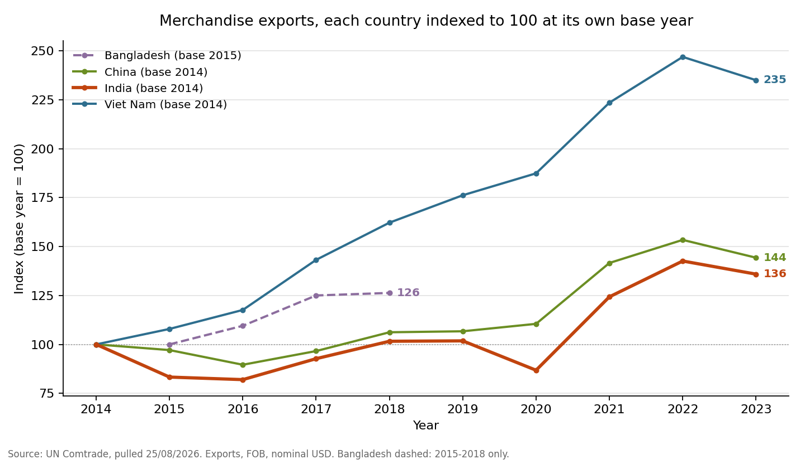

# International Trade Analytics: India's Export Profile (2014–2023)

A SQL-driven analysis of India's export performance over the past decade, benchmarked against three comparator economies (China, Bangladesh, Vietnam), sourced directly from the UN Comtrade API. Built as a portfolio project pairing PostgreSQL analysis with a planned Power BI dashboard.

**→ [Read the findings](insights/key_findings.md)** — twelve findings with the numbers, caveats attached.



> Over 2014–2023 India's exports compounded at **3.46% a year** to **USD 431.4bn**. Vietnam, a smaller exporter than India in 2014, compounded at **9.96%**. India's growth is concentrated in a commodity — petroleum is 20.7% of 2023 exports — whose value moves with world prices; Vietnam's is in manufactured goods.

## Why this project

This project reflects a long-standing interest in international trade and export markets. Trade data offered a stronger sourcing story than a pre-packaged Kaggle dataset — it required deliberately scoping an API pull rather than just loading a CSV someone else had already cleaned.

## Data source

**UN Comtrade API** (https://comtradeplus.un.org) — the UN Statistics Division's official repository of international merchandise trade statistics, built from member states' own customs declarations. Chosen over DGFT (India-only, narrower) and Kaggle mirrors (secondhand, unclear provenance) specifically for the stronger, more defensible sourcing story: primary international data, pulled programmatically, with documented reliability caveats (see below) rather than taken at face value.

The pull's exact parameters, its date, per-file checksums and a column-by-column data dictionary are recorded in **[`data/raw/README.md`](data/raw/README.md)** and [`data/raw/pull_manifest.json`](data/raw/pull_manifest.json).

**The API pull script is deliberately not included.** This repository is meant to reproduce *this* analysis on *this* data. UN Comtrade revises figures after publication, so a fresh pull would return different numbers and the committed findings would no longer match what the code produced. Freezing the raw CSVs — and publishing their checksums — makes the analysis reproducible by construction rather than dependent on an external service that changes underneath it.

### Scope

| Dimension | Decision |
|---|---|
| Reporters | India (primary) + China, Bangladesh, Vietnam (comparators). **Bangladesh: 2015–2018 only** — a genuine gap in what Comtrade holds, not a pull error; see `sql/02` assumption 2 |
| Time range | 2014–2023 (10 years; 4 for Bangladesh) |
| Trade flow | Exports only (Phase 1) |
| Valuation | Exporter-reported FOB, **nominal USD — no deflator applied** |
| Product detail | HS2 (chapter-level) across all ~97 chapters, for all 4 reporters — the broad "top categories and trends" layer. Plus HS6 (product-level) drill-down for India specifically, across 5 sectors: textiles, pharmaceuticals, gems & jewellery, petroleum products, and engineering/machinery |
| Partner markets | India's exports also pulled by 20 major partner countries (HS2 level), **with no World row** — so every Track C share is a share of that 20-partner panel (61.9%–64.4% of India's exports), not of India's global exports |

2024–2025 were deliberately excluded: UN Comtrade figures for recent years are frequently still being revised by reporting countries, so the pull is scoped to finalised, stable data.

### Known scope gaps, stated deliberately

- **Nominal, not real.** Every figure is nominal USD. The 2022 global commodity spike sits inside the data, so part of what reads as growth over 2014–2023 is price rather than volume — petroleum most of all. Deflating would require a price index this project does not pull.
- **No partner × sector crosstab.** Track B is HS6 to World; Track C is HS2 by partner. Nothing here answers "which markets buy India's pharmaceuticals" — the first question most readers have. That needs a fourth pull (India → 20 partners at HS6 across the five sectors) and is **Phase 2**, alongside imports, trade balance, and quantity/volume series.

## Data reliability

International trade statistics carry known limitations worth stating upfront rather than discovering later:

- **Exporter/importer asymmetry.** The same shipment reported by both trading partners rarely matches exactly — exports are valued FOB (free-on-board), imports CIF (cost, insurance, freight), a gap that alone can run 10–20%. This dataset uses each country's own *exporter*-reported figures consistently, never a partner's mirrored import figure, to avoid mixing valuation bases.
- **Reporting gaps get filled by estimation, not left blank.** When a country hasn't reported for a given year, UN Comtrade fills the gap via mirror data or extrapolation. The raw data carries explicit flags for this (`isReported`, `legacyEstimationFlag`). **`sql/02` V1a/V1b exercise those flags rather than merely noting them**, and the result matters: 51.6% of India's decade export value sits on estimated rows (China 72.4%, Bangladesh 70.2%, Vietnam 46.0%) — and the exposure is a *regime*, not a spread. India is 0% estimated through 2018 and 79–100% from 2019, so the two endpoints of any 2014-vs-2023 comparison are differently constructed. See [finding 12](insights/key_findings.md).
- **Confidentiality suppression.** Some countries withhold specific commodity/partner detail; the trade still counts in higher-level totals but won't appear broken out at the detailed level.

### Accuracy check against an external figure

Most validation in a project like this is self-consistency. One check is not: India's 2023 exports, summed here from 97 HS2 chapters, come to **USD 431,411,977,211**, against WITS's published **USD 431,411,977.21 thousand** — identical to the dollar. That confirms the aggregation is exactly right: no chapter missing, nothing double-counted.

WITS draws on UN Comtrade, so this validates the arithmetic rather than the underlying figure independently; a fully independent anchor would be India's DGCI&S statistics, which are fiscal-year (April–March) and so not directly comparable to these calendar-year totals.
*Source: [WITS India country profile](https://wits.worldbank.org/CountryProfile/en/IND), accessed 08/09/2026.*

## Repository structure

```
trade-analytics/
├── data/
│   ├── raw/                    # Raw CSV output from the UN Comtrade API pull
│   │   ├── README.md               # Provenance, exact API parameters, data dictionary
│   │   ├── pull_manifest.json      # Pull date, parameters, row counts, SHA-256 per file
│   │   ├── track_a_country_benchmark_hs2.csv
│   │   ├── track_b_india_sector_detail_hs6.csv
│   │   └── track_c_india_partner_view_hs2.csv
│   └── processed/              # Query outputs, committed so results are readable
│       └── *.csv                   # 10 result sets — regenerate with sql/05
├── scripts/
│   └── make_chart.py           # Renders the indexed trend chart above (reads data/processed/)
├── sql/
│   ├── 00_create_staging_tables.sql        # Raw (all-TEXT) staging tables + \copy load
│   ├── 01_data_cleaning.sql                # Cast + clean into analysis-ready tables
│   ├── 02_track_a_export_value_trend.sql   # Track A — trend, YoY, top HS2, CAGR/index, estimation sensitivity
│   ├── 03_track_b_sector_analysis.sql      # Track B — 5-sector HS6 deep dive
│   ├── 04_track_c_partner_analysis.sql     # Track C — 20-partner market view
│   └── 05_export_results.sql               # Writes the headline results to data/processed/
├── insights/
│   ├── key_findings.md         # ← the findings
│   └── indexed_export_trend.png
├── LICENSE
└── README.md
```

## Reproducing the analysis

The three CSVs are committed under `data/raw/`, so the whole analysis rebuilds **without an API key**. Run everything from the repository root — the `\copy` paths are relative to the working directory, not to the SQL files.

```bash
createdb trade_analytics   # PostgreSQL 15+ (developed on 18)

psql -d trade_analytics -v ON_ERROR_STOP=1 -f sql/00_create_staging_tables.sql   # creates AND loads
psql -d trade_analytics -v ON_ERROR_STOP=1 -f sql/01_data_cleaning.sql
psql -d trade_analytics -v ON_ERROR_STOP=1 -f sql/02_track_a_export_value_trend.sql
psql -d trade_analytics -v ON_ERROR_STOP=1 -f sql/03_track_b_sector_analysis.sql
psql -d trade_analytics -v ON_ERROR_STOP=1 -f sql/04_track_c_partner_analysis.sql

psql -d trade_analytics -v ON_ERROR_STOP=1 -f sql/05_export_results.sql          # optional: rewrites data/processed/
python3 scripts/make_chart.py                                                    # optional: redraws the chart
```

Expected row counts after `01`: **3,282 / 16,976 / 18,956**. Each file opens with its assumptions and ends with a validation block — read those first.

**Run order matters.** `03` V5 and `04` Q4/V5 both read `clean_track_a_country_benchmark`: Track B's cross-track reconciliation and Track C's panel-coverage rescaling are measured *against* Track A. The tracks are not independent, and running `03` or `04` before `02`'s clean table exists will fail on a missing table.

**No API key, no network access, no re-pull.** Every input is in the repository. `data/raw/pull_manifest.json` carries a SHA-256 for each CSV, so you can confirm the files you have are the ones the analysis was built on:

```bash
shasum -a 256 data/raw/*.csv        # compare against data/raw/pull_manifest.json
```

## Analysis

- **Track A** (`sql/02`) — total export value trend and year-on-year growth, India vs the three comparators; each country's top HS2 export categories; decade CAGR and an indexed series rebased to 100; and an estimation-flag sensitivity block.
- **Track B** (`sql/03`) — the five focus sectors: value trend, YoY growth, 2014-vs-2023 composition shift, top HS6 products per sector, and product concentration (top-5 share + HHI). Ends with a cross-track reconciliation against Track A — worst divergence across all 50 sector-years is −2.46%.
- **Track C** (`sql/04`) — the 20-partner panel: value trend, YoY growth, ranked share of panel, concentration over time with a bounded whole-market HHI estimate, and rank shifts with top HS2 chapters per leading partner.

Findings are written up in **[`insights/key_findings.md`](insights/key_findings.md)**, and the underlying result sets are committed as CSVs in `data/processed/` so nothing has to be taken on trust.

## Tech stack

PostgreSQL 18 · pgAdmin 4 · Python (UN Comtrade API pull, matplotlib chart) · Power BI (planned dashboard phase)

## About this project

Built by **[Veshy25](https://github.com/Veshy25)** as a self-directed portfolio project, to work end-to-end through the parts of an analysis that usually get skipped: scoping an API pull rather than downloading a cleaned dataset, declaring assumptions before running a query rather than justifying results afterwards, validating against something external rather than only against itself, and finishing with written conclusions rather than a folder of SQL.

Things it deliberately does the harder way, and why:

- **Assumptions are written above each query, not below the results.** Every analysis file opens with a numbered assumption block and closes with a validation block.
- **Every numeric claim in a comment is falsifiable.** Where a comment quotes a figure, the query that produces it is in the same repository and the result is committed under `data/processed/`.
- **Limits are stated rather than discovered.** Nominal-vs-real, the Bangladesh gap, share-of-panel versus share-of-world, and the estimation-flag regime are all named up front — in the README, in the SQL headers, and in the findings.
- **Corrections are kept visible.** Where an earlier version got something wrong — the `isAggregate` flag misread as an estimation marker, or `aggr_level` mistaken for the double-counting guard — the fix is in the comments alongside what the guard actually is.

Feedback and corrections are genuinely welcome: open an issue.

## Licence

[MIT](LICENSE) for the SQL, scripts and documentation — reuse freely, attribution appreciated. The underlying trade statistics in `data/raw/` are sourced from UN Comtrade and remain subject to UN Comtrade's terms of use.
