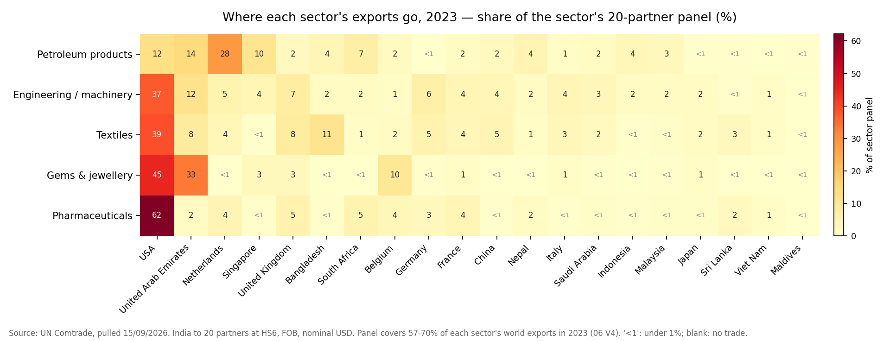
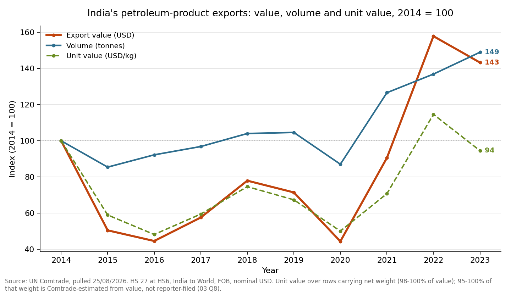

# Trade Analytics — Key Findings

India's merchandise trade, 2014–2023: exports benchmarked against China,
Bangladesh and Vietnam (findings 1–12), then — from a second pull — where each
sector's exports go, imports and trade balance, and volume against value
(findings 13–20). Every figure below is traceable to a named query in `sql/`,
and the underlying result sets are committed as CSVs in `data/processed/` so
nothing here has to be taken on trust. The single exception is finding 11's
external WITS anchor, which is cited to its source and is not derived here.

**Read this first — five things that shape every number on the page:**

- **All figures are nominal USD**, exporter-reported FOB. There is no deflator
  applied. The 2022 global commodity spike is therefore *inside* these numbers:
  part of what reads as growth is price, not volume, and petroleum is where
  that distortion is largest.
- **Bangladesh has 2015–2018 only** — four years, no 2023. WITS carries
  nothing for Bangladesh after 2015 either, so the missing recent years are a
  gap in the source rather than in the pull (`sql/02` assumption 2). WITS and
  this project agree on the year of the value they share (2015); until
  23/09/2026 this note said WITS labelled it 2016, which was a misreading of
  the WITS page. Bangladesh's growth rate spans three years and is not
  comparable to a nine-year rate without saying so.
- **Track C shares are share-of-panel, not share-of-world.** The 20 partner
  markets cover 61.9%–64.4% of India's exports, so a partner at "27.8%" holds
  27.8% of the tracked panel, not of India's global exports. The same applies
  to Track D (57–70% of each sector's exports **in 2023**, `sql/06` V4 — over
  all fifty sector-years the range is 52.3–71.3%) and to Track E2 (50–58% of
  India's imports, `sql/07` V5).
- **The panel is a selection, not India's top 20 — and it was chosen for
  exports.** No selection rule survives in the project's records; it holds
  India's largest markets, all four South Asian neighbours whatever their size
  (the Maldives is 0.2% of it) and Viet Nam. Reused for imports, it covers
  54.7% of India's 2023 imports overall but only **33.9% of mineral fuels and
  37.8% of precious stones and metals** (`sql/07` V5b), so energy and gold
  suppliers outside the twenty are missing. Every partner ranking below —
  bilateral balances above all — is a ranking *within the panel*.
- **Balances are FOB exports minus CIF imports.** Imports are valued including
  freight and insurance; exports are not. That is how published merchandise
  balances are built, but it overstates every deficit here by the freight
  margin (`sql/07` assumption 1).
- **Two pulls, two dates.** Exports were pulled 25/08/2026; imports and the
  partner × sector data on 15/09/2026. Every cross-check between them is
  reported in the SQL validation blocks. Petroleum reconciles exactly across
  the two pulls; textiles (0.18%), pharmaceuticals (0.97%) and gems &
  jewellery (1.95%) stay within 2%; engineering/machinery in 2022 runs to
  −11.5%. Eleven of the 1,000 partner-years checked exceed 1% — ten
  engineering 2022, one gems 2022. That points to a Comtrade data property
  rather than pull-date drift: Track B diverges from Track A in the same
  sector-year (finding 10), and those two come from the *same* pull. It is an
  inference, not a proof — no series was pulled on both dates.

---

## Headline

> Over 2014–2023 India's exports compounded at **3.46% a year**, reaching
> **USD 431.4bn**. Vietnam — a smaller exporter than India in 2014 — compounded
> at **9.96%** and more than doubled. The two paths look different in kind: a
> fifth of India's basket is mineral fuels (20.7% of 2023 exports), which ties
> much of its value to world energy prices, and India's series swung hardest of
> the four — down 16.7% in 2015 and 14.8% in 2020, up 43.3% in 2021 — while
> Vietnam's, led by electronics (HS 85, 37.6% of its 2023 exports), grew every
> year to 2022. But India's *growth* was not an oil story: of the USD 113.9bn
> it added over the decade, machinery and electronics (HS 84–85) supplied
> 34.3% and petroleum 23.7%.

> [!summary] If you read nothing else
> - **India grew slowest of the four**: 3.46% a year, against Vietnam's 9.96% (finding 1).
> - **The path was volatile, not steady**: −18% to 2016, then +74% to the 2022 peak (finding 2); fuels, a fifth of exports, carried 43% of the 2023 fall (findings 3–4).
> - **Engineering led India's sector growth**, 61% of the five focus sectors' net gain, and the US took a growing share of it (findings 5, 15).
> - **India runs a USD 241bn deficit**, 55% of it in mineral fuels; pharma is the largest surplus chapter (findings 16, 18).
> - **Read every share as a share of a panel, and every volume as partly Comtrade-estimated** — the two caveats that constrain the most findings (preamble, finding 17).

---

## 1. India grew, but slowest of the four benchmarked economies

**CAGR 2014→2023: India 3.46%, China 4.16%, Vietnam 9.96%.**
Bangladesh compounded at 8.08%, but over 2015–2018 only.

| Country | First year | Last year | First (USD bn) | Last (USD bn) | CAGR |
|---|---|---|---:|---:|---:|
| Viet Nam | 2014 | 2023 | 150.2 | 353.1 | **9.96%** |
| Bangladesh | 2015 | 2018 | 31.7 | 40.1 | 8.08% *(3 yrs)* |
| China | 2014 | 2023 | 2,342.3 | 3,379.7 | 4.16% |
| **India** | 2014 | 2023 | 317.5 | **431.4** | **3.46%** |

*Source: `sql/02` Query 4 · `data/processed/track_a_cagr.csv`*

Headline sources: growth contribution by chapter, `sql/02` Query 6 ·
`data/processed/track_a_india_chapter_contribution_2014_2023.csv`; Vietnam's
HS 85 share, `track_a_top10_chapters.csv` against `track_a_country_year_totals.csv`;
year-on-year moves, `track_a_country_year_totals.csv`.

Indexed to each country's own base year, 2023 stands at **235 for Vietnam,
144 for China, 136 for India**. Vietnam's exports grew **135% against India's
36%** over the same ten years — close to four times the growth, from a starting
base less than half the size (USD 150.2bn against India's 317.5bn in 2014). By
2023 Vietnam had closed to 82% of India's total.

*Source: `sql/02` Query 4b · `data/processed/track_a_indexed_series.csv`*

## 2. The decade is really two halves, and the first one went backwards

India's exports **fell for two consecutive years from the 2014 base**, bottoming
at USD 260.3bn in 2016 — 18% below where the decade started. The index does not
recover to 100 until 2018 (101.6).

| Year | USD bn | YoY |
|---|---:|---:|
| 2014 | 317.5 | — |
| 2015 | 264.4 | **−16.7%** |
| 2016 | 260.3 | −1.5% |
| 2017 | 294.4 | +13.1% |
| 2018 | 322.5 | +9.6% |
| 2019 | 323.3 | +0.2% |
| 2020 | 275.5 | **−14.8%** |
| 2021 | 394.8 | **+43.3%** |
| 2022 | 452.7 | +14.7% |
| 2023 | 431.4 | −4.7% |

Quoting decade CAGR alone hides this. A reader told "3.46% a year" pictures
steady compounding; the actual path is −18%, then +74% off the trough to the
2022 peak — and +66% to 2023, since the last year gave some of it back.

*Source: `sql/02` Queries 1–2 · `data/processed/track_a_country_year_totals.csv`*

## 3. 2022 was the peak, and it was substantially a price event

**USD 452.7bn in 2022 is the decade high** — 40% above 2019 in nominal terms.
Petroleum (HS 27) went from USD 56.4bn in 2021 to **98.5bn in 2022**, a 75%
jump in one year, in a year when crude prices rose sharply.

The 2023 fall confirms it. India's exports dropped USD 21.3bn from 2022, and
**petroleum alone accounts for USD 9.1bn of that — 43% of the total decline**,
from a chapter that is 20.7% of exports. Gems & jewellery (−5.8bn) and iron and
steel (−3.4bn) supply most of the rest.

*Source: `sql/02` Query 1 and Query 5 · `data/processed/track_a_country_year_totals.csv`,
`track_a_india_chapter_change_2022_2023.csv` (the −9.14 / −5.84 / −3.39 chapter
falls) · petroleum's 2021→2022 rise from `sql/03` Query 1 ·
`track_b_sector_year_totals.csv`*

Because these are nominal figures, any 2014-vs-2023 or 2019-vs-2022 comparison
in this project carries an unquantified price component. Deflating to constant
USD would need a price index the project does not currently pull — a stated
limitation, not an oversight.

## 4. India's export basket is led by a commodity, not a manufacture

**Mineral fuels (HS 27) are 20.7% of India's 2023 exports at USD 89.3bn** —
2.7 times the next chapter.

| Rank | HS2 | Chapter | 2023 USD bn | Share |
|---:|---|---|---:|---:|
| 1 | 27 | Mineral fuels, oils | **89.3** | **20.7%** |
| 2 | 71 | Pearls, precious stones, jewellery | 33.4 | 7.7% |
| 3 | 85 | Electrical machinery | 32.3 | 7.5% |
| 4 | 84 | Machinery, mechanical appliances | 29.3 | 6.8% |
| 5 | 30 | Pharmaceutical products | 21.3 | 4.9% |
| 6 | 87 | Vehicles | 20.8 | 4.8% |

This is the mechanism behind finding 2's volatility, not behind finding 1's
slow growth. A fifth of the export book prices off world energy markets, which
is why India's series swings hardest in both 2020 and 2022 while Vietnam's
climbs steadily through both. It is a *level* share: petroleum's share of the
decade's *growth* is similar (23.7%, the largest single chapter), and
machinery and electronics together added more (34.3%, `sql/02` Query 6).
Finding 17 adds the volume side: across the whole decade, petroleum's growth
was tonnes, not price — as far as Comtrade's estimated tonnage can show it.

*Source: `sql/02` Query 3 · `data/processed/track_a_top10_chapters.csv`*

## 5. Within the five focus sectors, engineering led the growth

**Engineering/machinery compounded at 11.79%, nearly tripling from USD 22.6bn
to 61.6bn** — USD 39.0bn of the five sectors' USD 64.0bn net increase (61%).
Petroleum added 27.0bn and pharmaceuticals 9.6bn; two of the five sectors
*shrank* in nominal terms. (Titled "the growth is entirely in engineering"
until 23/09/2026, which the table below never supported.)

| Sector | 2014 USD bn | 2023 USD bn | CAGR |
|---|---:|---:|---:|
| Engineering / machinery | 22.6 | 61.6 | **+11.79%** |
| Pharmaceuticals | 11.7 | 21.3 | +6.92% |
| Petroleum products | 62.3 | 89.3 | +4.08% |
| Textiles | 38.6 | 34.2 | **−1.33%** |
| Gems & jewellery | 40.7 | 33.4 | **−2.16%** |

Textiles and gems & jewellery are traditional strengths of India's export base,
and both are smaller in 2023 than in 2014 *before* any inflation adjustment. In
real terms the decline is steeper than shown.

*Source: 2014 and 2023 values `sql/03` Query 1 ·
`data/processed/track_b_sector_year_totals.csv` · CAGRs `sql/03` Query 6 ·
`track_b_sector_volume_vs_value.csv` (`value_cagr_pct`)*

## 6. Sector concentration varies by two orders of magnitude

**Textiles HHI 118; pharmaceuticals HHI 5,751** — a 49× spread on the same
0–10,000 scale.

| Sector | HS6 products (2023) | Top-5 share | HHI 2023 |
|---|---:|---:|---:|
| Pharmaceuticals | 43 | 91.3% | **5,751** |
| Petroleum products | 41 | 98.6% | 5,238 |
| Gems & jewellery | 53 | 96.5% | 3,831 |
| Engineering / machinery | 826 | 36.2% | 624 |
| Textiles | 784 | 15.4% | **118** |

**Caveat that must travel with this number:** the three highest scores are
sectors defined as a *single HS2 chapter* (27, 30, 71). They are concentrated
partly by construction — a definition artefact as much as a market fact.
Textiles (14 chapters) and engineering (2) are not comparable to them without
that qualification.

`hs6_products_2023` counts HS6 codes with a 2023 line — within one year and
one HS edition, a code is a product, so this is the right denominator for a
2023 index. It is **not** comparable to a decade-wide count. Engineering shows
863 distinct codes across 2014–2023 and textiles 821, but those span three HS
editions, and editions split, merge and retire codes: 32 of engineering's 37
"missing" codes and 30 of textiles' 37 last appear in 2016 or 2021, the year
before an edition change. They are mostly renumbered products, not products
India stopped exporting. The CSV column is now `hs6_codes_all_years` to say
so; until 23/09/2026 it was `hs6_products_all_years` and this paragraph read
it as "37 more products".

*Source: `sql/03` Query 5 · `data/processed/track_b_sector_concentration_2023.csv`*

## 7. India's export markets are never highly concentrated, and on any realistic reading are low

The 20-partner panel returns **HHI 1,180 in 2023**, but that number is computed
on a panel covering only 63.1% of India's exports, so it overstates
concentration by roughly 2.5× (shares inflate ~1.6×; HHI is quadratic).

Rescaling against Track A's India→World total brackets the true figure:

| | 2014 | 2023 |
|---|---:|---:|
| Panel HHI (not band-comparable) | 1,007 | 1,180 |
| Panel coverage | 61.9% | 63.1% |
| **True HHI, lower bound** | 386 | **470** |
| **True HHI, upper bound** | 1,839 | **1,831** |

The upper bound assumes the entire unobserved 37% is a *single* hidden
partner — one country taking about twice the USA's 17.6% of India's exports.
That is implausible, but it is a genuine ceiling, and it peaks at 1,889 (2022).
The lower bound, 386–481 across the decade, assumes the residual is spread
thinly across many markets.

What that supports depends on whose bands you use — they are antitrust
heuristics from US merger review, borrowed, not a trade standard. On the 2010
US guidelines' bands (under 1,500 unconcentrated, 1,500–2,500 moderate, over
2,500 highly concentrated), the ceiling sits in the *moderate* band every year
and never reaches *highly concentrated*. The 2023 US Merger Guidelines replaced
those bands with a single 1,800 line, which the ceiling crosses in 2014–2016,
2022 and 2023. So: **never highly concentrated on the 2010 bands under any
assumption, and low under any realistic one.** Until 23/09/2026 this finding
said "unconcentrated under any assumption", which its own upper bound did not
support.

*Source: `sql/04` Query 4 · `data/processed/track_c_partner_concentration.csv`*

## 8. But the top of the partner table is concentrated

**The USA alone takes 27.8% of the tracked panel at USD 75.8bn in 2023** — more
than twice the UAE in second place, and the top five take 59.0%.

| Rank | Partner | 2023 USD bn | Share of panel |
|---:|---|---:|---:|
| 1 | USA | **75.8** | **27.8%** |
| 2 | United Arab Emirates | 33.0 | 12.1% |
| 3 | Netherlands | 23.1 | 8.5% |
| 4 | China | 16.2 | 6.0% |
| 5 | United Kingdom | 12.5 | 4.6% |

Findings 7 and 8 are not in tension: the *tail* is long enough to keep whole-
market HHI low, while the *head* is heavy enough that a single trading
relationship carries real exposure. HHI is the wrong instrument for that risk;
the top-1 share is the right one.

*Source: `sql/04` Query 3 · `data/processed/track_c_partner_totals.csv`*

## 9. The Netherlands made the largest gain after the USA

**The Netherlands climbed from 8th to 3rd** in India's partner table between
2014 and 2023, adding USD 16.3bn to reach 23.1bn — the largest value gain of
any partner after the USA (+33.1bn). By places it shares the biggest climb,
five, with Italy, Nepal and Indonesia; the biggest moves were falls, Sri Lanka
down nine places and Viet Nam eight. (Titled "the decade's biggest mover" until
23/09/2026.)

*Source: `sql/04` Query 5a · `data/processed/track_c_partner_rank_moves.csv`*

A caution on interpretation: the Netherlands hosts Rotterdam, Europe's largest
port, so some of this is transshipment recorded against the port of entry rather
than final consumption. Comtrade records the declared partner. This is a known
limitation of partner-level trade data, not a data error.
*[Interpretation, not a figure derived from this dataset.]*

## 10. The sector detail reconciles to the chapter rollup within 2.46%

Track B (HS6 product detail) and Track A (HS2 chapter rollup) are separate API
pulls at different aggregation levels. Summing the Track A chapters behind each
sector should reproduce the Track B sector totals.

**Across all 50 sector-years the worst divergence is −2.46%** (engineering/
machinery, 2022), with mean divergence −0.25% or tighter in every sector. The
second-worst is −1.05%.

This is the project's strongest internal control: two datasets pulled
separately (from the same source, on the same day), at different
granularities, agree within 2.5% in every sector-year — within 0.005% in 44 of
the 50, and to the dollar in 8. The worst gap, −2.46%, is USD 1.33bn. (This
said "independently pulled … within a rounding error" until 23/09/2026.)

*Source: `sql/03` V5 · `data/processed/track_b_cross_track_reconciliation.csv`*

## 11. The chapter totals reconcile exactly to the published all-commodities figure

India's 2023 exports, summed here from 97 HS2 chapters, come to
**USD 431,411,977,211**. WITS (World Bank / ITC / UNCTAD / UN Comtrade / WTO)
publishes India's 2023 merchandise exports as **USD 431,411,977.21 thousand** —
identical to the dollar.

This confirms the aggregation is exactly right: no chapter missing, nothing
double-counted, no rollup row silently included.

**Honest limit on this check:** WITS draws on UN Comtrade, so it is not a fully
independent source. It validates the *arithmetic*, not Comtrade's underlying
figure. A genuinely independent anchor would be India's DGCI&S national
statistics, which are compiled on a fiscal-year (April–March) basis and so are
not directly comparable to these calendar-year totals.

*Source: `sql/02` Query 1 · [WITS India country profile](https://wits.worldbank.org/CountryProfile/en/IND), accessed 08/09/2026*

## 12. Nothing in this data is flagged as an estimated *value* — but India's chapter figures change construction basis mid-decade

**This finding previously said the opposite, and the correction is the finding.**
Until 17/09/2026 it read "Half of India's decade export value is
Comtrade-estimated", built on rows carrying `legacyEstimationFlag = 4`, which
this project treated as "estimated by Comtrade rather than as-reported". That
reading was wrong.

`legacyEstimationFlag` is a **quantity and net-weight** code, not a value code.
UN Statistics Division, *Quantity and Weight information in UN Comtrade*
(October 2009), §4.1: `0` = no estimation, `2` = quantity only, `4` = net
weight only, `6` = both. Neither that document nor the 2019 methodology guide
describes any flag for an estimated value.

The data confirms it without the document. On Track B, which carries the flag
and both modern booleans, every flag-2 row (162) is quantity-only estimated,
every flag-4 row (3,776) net-weight-only and every flag-6 row (6,656) both.
The reverse does not hold: 2,905 flag-0 rows are estimated too (2
quantity-only, 1,187 net-weight-only, 1,716 both) — the flag was never
back-filled for them, the same one-way pattern as Track A's 552 rows. `sql/02`
V1a asserts the flag-to-boolean direction on Track A rather than describing
it. (Until 23/09/2026 this paragraph said "exactly … no exceptions", true in
one direction only.)

And the part that settles it: **`netWgt` on the HS2 tracks holds no positive
value at all** — blank on 48.3% of Track A rows and exactly `0` on the other
51.7%. The flag was marking estimation of a quantity this track does not carry.
It never said anything about the export values every figure above is built from.

**What is actually true, and does bear on findings 1–3.** Each reporter files
its chapter figures directly for the first year or two of the series, after
which Comtrade assembles them by rolling up that reporter's HS6 detail — the
`isReported` → `isAggregate` switch. It happens once per reporter and never
reverses:

| Reporter | Files directly | Switches to rollup | Rollup share after |
|---|---|---|---:|
| China | 2014 | **2015** | 100% |
| Viet Nam | 2014–2015 | **2016** | 100% |
| Bangladesh | 2015 | **2016** | 100% |
| India | 2014–2016 | **2017** | 100% |

So India's 2014 total is a direct filing and its 2023 total is a Comtrade
rollup. The two endpoints of the headline growth comparison are assembled
differently — which is the caveat the old wording was reaching for, with the
wrong column. It is a statement about *how the figure was built*, not about
whether it was estimated, and it does not invalidate the comparison: these are
the standard published figures, and finding 11 shows India's 2023 chapter sum
reconciling to WITS to the dollar.

For completeness, the net-weight exposure the flag *does* measure is in the CSV
as `pct_value_on_netwgt_est_rows` (India 70.0% of decade value, China 89.2%,
Bangladesh 70.2%, Viet Nam 61.3%). It is reported because the column exists,
not because it constrains anything here — at HS2 there is no weight to estimate.
Where it genuinely matters is finding 17, at HS6, where weight *is* populated.

*Source: `sql/02` V1a/V1b · `data/processed/track_a_reporting_basis.csv` ·
[UNSD, Quantity and Weight information in UN Comtrade](https://comtradeapi.un.org), October 2009, §4.1*

---

# Phase 2 — markets by sector, imports, and volume

Second pull, 15/09/2026. Three new tracks: **D** — India's exports to the same
20 partners at HS6 for the five sectors; **E** — imports for the four countries
and for India by partner; and the volume columns already in Track B, carried
into the analysis for the first time.

## 13. The USA takes 62% of India's pharma exports to the panel — and at least 35% of the world total

**USD 7.55bn of pharmaceuticals went to the USA in 2023: 62.2% of the
20-partner panel**, with the UK (5.2%) and South Africa (5.1%) a distant second
and third. Pharma is the most single-market-dependent sector by a wide margin.

| Sector | #1 market | Share of panel | #2 | #3 |
|---|---|---:|---|---|
| Pharmaceuticals | USA | **62.2%** | UK 5.2% | South Africa 5.1% |
| Gems & jewellery | USA | 44.8% | UAE 33.4% | Belgium 9.7% |
| Textiles | USA | 38.7% | Bangladesh 11.0% | UAE 8.2% |
| Engineering / machinery | USA | 37.4% | UAE 11.6% | UK 7.3% |
| Petroleum products | Netherlands | 28.5% | UAE 14.2% | USA 12.4% |

Because the panel covers only 57.0% of India's pharma exports to the world
(`sql/06` V4), the USA's share of the *world* total is at least
7.55 / 21.30 = **35.4%** — a floor, not an estimate, since the unobserved 43%
could contain more US trade but not less. Four of the five sectors have the USA
as their largest market; petroleum is the exception.

What the USA buys under this sector is packaged medicaments (HS 300490,
300420, 300410 — the top three products). Whether it also buys India's bulk
active ingredients this data cannot say: those sit mostly in HS 29 (organic
chemicals), outside the pharmaceuticals sector as defined here (HS 30 only).

*Source: `sql/06` Queries 1 and 3 · `data/processed/track_d_sector_partner_matrix_2023.csv`, `track_d_top_products_by_market.csv`*

## 14. Finding 9 explained: the Netherlands' rise is petroleum, and it displaced Saudi Arabia and Japan

**The Netherlands' share of India's panel petroleum exports went from 7.3% in
2014 to 28.5% in 2023** — a 21.2-point gain, the largest shift of any
sector–market pair in the data — reaching USD 15.0bn. Over the same period
**Saudi Arabia fell from 18.8% to 1.8%** (USD 7.2bn → 0.9bn) and **Japan from
5.4% to 0.3%** (2.1bn → 0.1bn).

| Sector | Market | 2014 share | 2023 share | Shift |
|---|---|---:|---:|---:|
| Petroleum | Netherlands | 7.3% | 28.5% | **+21.2 pt** |
| Petroleum | Saudi Arabia | 18.8% | 1.8% | **−17.1 pt** |
| Gems & jewellery | UAE | 47.6% | 33.4% | −14.2 pt |
| Engineering | USA | 24.1% | 37.4% | +13.3 pt |
| Gems & jewellery | USA | 32.5% | 44.8% | +12.3 pt |
| Textiles | USA | 26.7% | 38.7% | +12.0 pt |
| Textiles | China | 11.8% | 4.6% | −7.2 pt |

The Rotterdam caution in finding 9 stands: a share of this is refined product
landed at Europe's largest port for onward distribution, recorded against the
Netherlands. Comtrade records the declared partner.

*Source: `sql/06` Query 2 · `data/processed/track_d_sector_partner_shift.csv`*

## 15. Engineering and textiles concentrated into the USA; gems shifted toward it; petroleum concentrated into the Netherlands

**Engineering's panel HHI rose from 998 to 1,745 and textiles' from 1,287 to
1,857** between 2014 and 2023, in both cases because the USA's share grew by
12–13 points. The top-3 share rose from 42.5% to 56.2% for engineering and
51.6% to 57.9% for textiles.

Gems' HHI eased (3,472 → 3,240) but not because it moved away from the USA:
the USA's share *rose* 32.5% → 44.8%, the fifth-largest shift in the data,
while the UAE's fell faster (47.6% → 33.4%). Petroleum's HHI rose too
(1,175 → 1,406), but into the Netherlands (7.3% → 28.5%), with the USA
roughly flat (+0.7 points). Pharma (4,134 → 3,991) eased slightly from a
one-market book. (Titled "every sector except gems and pharma concentrated
further into the USA" until 23/09/2026 — wrong for gems and for petroleum.)

These are panel HHIs and are not scored against the usual bands — the panel is
not the whole market (`sql/06` assumption 6). The direction is what the data
supports: the manufactured-goods sectors are becoming more US-dependent, not
less.

*Source: `sql/06` Queries 2 and 4 · `data/processed/track_d_sector_market_concentration.csv`, `track_d_sector_partner_shift.csv`*

## 16. India runs a structural deficit that widened from USD 142bn to 241bn; Vietnam widened its surplus

**India imported USD 672.1bn in 2023 against exports of 431.4bn — a deficit
of USD 240.7bn, 21.8% of total trade.** The deficit was USD 141.8bn in 2014
(18.3% of trade) and has stayed between 14% and 24% of trade every year since,
narrowest in 2020 (14.4%) and 2016 (15.6%) — both years when import prices
collapsed — and widest in 2022 (23.6%). Exports covered 64.2% of imports in 2023,
down from 69.1% in 2014.

| Country | 2014 balance (USD bn) | 2023 balance (USD bn) | 2023, % of trade |
|---|---:|---:|---:|
| China | +383.1 | **+823.0** | +13.9% |
| Viet Nam | +2.4 | **+27.6** | +4.1% |
| India | −141.8 | **−240.7** | −21.8% |
| Bangladesh | −16.3 *(2015)* | −40.4 *(2018)* | −33.5% *(2018)* |

Vietnam is the contrast case again: a small surplus in 2014 (+2.4bn), a
deficit in 2015 (−3.8bn), and a surplus every year since 2016, reaching
+27.6bn in 2023. (This finding said Vietnam "swung to surplus" until
23/09/2026; it was already in surplus in 2014.) It did this with
imports growing almost as fast as exports — it is not import substitution, it
is an export base that grew faster than the country's own demand.

The 2023 India total matches WITS's published figure of USD 672,140 million,
the import-side twin of finding 11.

*Source: `sql/07` Query 1, V4 · `data/processed/track_e_country_trade_balance.csv` · [WITS India country profile](https://wits.worldbank.org/CountryProfile/en/Country/IND/Year/2023/Summary), accessed 15/09/2026*

## 17. Petroleum's decade growth was volume, not price — as Comtrade records the tonnage

**India shipped 108.9 million tonnes of petroleum products in 2023 against
73.1 in 2014 — up 49%. The unit value fell from USD 0.853/kg to 0.807/kg, down
5.5%.** The 43% rise in export value over the decade is therefore entirely
tonnage; price ended the period below where it started.

> **Read this with the finding, not after it.** 95.3% of that 2023 tonnage —
> and 95.3% in 2014, peaking at 99.7% in 2020 — sits on rows where **Comtrade
> estimated the net weight rather than India reporting it**. Comtrade's stated
> method is to derive missing weight from the value using weighted or standard
> unit values (UNSD, October 2009). So the "volume" series is, for most of its
> mass, value divided by an assumed price, and this finding cannot fully
> separate "India shipped more tonnes" from "Comtrade's unit-value assumption
> moved less than India's reported value". The direction is probably right —
> the value and volume indices diverge far more than any plausible error in
> those assumptions — but it is not the clean volume-versus-price
> decomposition the headline implies, and `sql/03` Q8 now reports
> `weight_estimated_kg_pct` so the exposure travels with the number.
>
> Note this is a *kilogram-weighted* share. The row-based share, which was the
> only one Q8 reported until 17/09/2026, reads a comfortable 23.8–63.2% for
> petroleum — because the estimated rows are the enormous ones. Never quote
> the row figure as the tonnage figure.

The intervening years were the opposite. From 2014 to 2016, value fell 56% while
tonnes fell only 8%: the collapse was price. 2022's spike was price too — unit
value index 114.6, volume 136.9, value 157.9 — which is what finding 3 said,
and it remains true for that year. But the endpoint comparison is a volume
story, and the value chart alone cannot show it.

| Sector | Tonnes 2014→2023 | Coverage-adjusted | Unit value 2014→2023 | Value CAGR | Volume CAGR | Tonnage Comtrade-estimated, 2014 → 2023 | Reading |
|---|---:|---:|---:|---:|---:|---:|---|
| Petroleum products | +49.0% | +51.6% | −5.5% | 4.1% | 4.5% | 95.3% → 95.3% | all volume, on estimated weight |
| Pharmaceuticals | +78.1% | +78.1% | +2.6% | 6.9% | 6.6% | 97.1% → 100.0% | all volume, on the most-estimated weight of the four |
| Engineering / machinery | +78.1% | +88.3% | +44.8% | 11.8% | 6.6% | 69.2% → 90.8% | volume, plus a mix shift toward phones — see below |
| Textiles | −14.9% | −10.5% | −0.9% | −1.3% | −1.8% | 30.6% → 57.1% | a decline in tonnes, and the least estimated of the five |
| Gems & jewellery | — | — | — | −2.2% | — | 91.1% → 99.9% | **no volume claim**: weight covers only 40% of 2014 value |

**Two limits on reading this table** (added 23/09/2026):

- **Tonnes are summed only over rows that carry a weight.** When that coverage
  moves between the endpoint years, so does the tonnage change. The
  coverage-adjusted column scales tonnes up by each year's value coverage,
  assuming the unweighed rows ship at the same USD/kg as the weighed ones. It
  is also why value change ≠ tonnes change × unit-value change in the table
  (engineering: 1.781 × 1.448 = 2.579 against a value ratio of 2.727 — the
  gap is exactly the coverage ratio, 96.2% / 91.0%).
- **A sector's USD/kg is a mix-weighted average, not a price.** Engineering's
  +44.8% was read here as "moving up the value chain". Most of it is one
  product line: mobile phones (851712, split into 851713/851714 in HS 2022)
  went from USD 0.56bn in 2014 to 14.29bn in 2023 — 23.2% of the sector — at
  roughly USD 1,000/kg against about 12 for the rest. Excluding phones from
  both years, the sector's unit value rose **11.43 → 12.72 USD/kg, +11.3%**
  (`sql/03` Q6b). The rise is mainly a shift in *what* India exports, not
  higher prices across the basket.

The estimation column ranks trustworthiness. Textiles is the sector where the
volume reading is most trustworthy (30.6% → 57.1% of tonnage estimated);
pharmaceuticals is where it is least (97.1% → 100.0%), with petroleum close
behind (95.3% in both years) — the reverse of what their coverage percentages
alone would suggest. (Until 23/09/2026 this paragraph named petroleum as the
least trustworthy, against its own table.)

Textiles is the one sector where the volume data changes the reading most:
5.86 million tonnes in 2023 against 6.89 in 2014 (−14.9%), and no year after
2018 back above the 2014 level except 2021. Adjusted for the fall in weight
coverage (97.8% → 93.0%), the decline is nearer −10.5%. Either way it is a
shrinking physical export, not a nominal artefact; the size is less certain
than the direction.

Gems & jewellery is excluded on coverage (`sql/03` Q8): only 40% of its 2014
value sits on rows with a net weight, and weight is a poor measure of gems in
any case. The row is in the CSV, flagged.

*Source: `sql/03` Queries 6–8 · `data/processed/track_b_sector_volume_vs_value.csv`, `track_b_engineering_unit_value_mix.csv`, `track_b_petroleum_volume_series.csv`, `track_b_volume_coverage.csv`*

## 18. Half of India's deficit is one chapter, and the surplus chapters are small

**Mineral fuels (HS 27) ran a USD 131.3bn deficit in 2023 — 220.6bn imported
against 89.3bn exported — 55% of the total deficit.** Electrical machinery
(−43.8bn), precious stones and metals (−39.2bn) and machinery (−27.8bn) follow.
India is a net importer in three of its own five focus sectors — petroleum,
gems and engineering — despite being a large exporter in each.

The largest surplus chapter is pharmaceuticals at **+18.7bn** (21.3bn out, 2.6bn
in), then vehicles (+13.1bn) and cereals (+11.1bn). The ten largest surpluses
sum to USD 80.8bn; the ten largest deficits to 305.9bn — both re-derived from
the CSV below on 17/09/2026, having been published as 65.3 and 310.9.

| Side | HS2 | Chapter | Exports | Imports | Balance (USD bn) |
|---|---|---|---:|---:|---:|
| Deficit | 27 | Mineral fuels | 89.3 | 220.6 | **−131.3** |
| Deficit | 85 | Electrical machinery | 32.3 | 76.1 | −43.8 |
| Deficit | 71 | Pearls, stones, precious metals | 33.4 | 72.7 | −39.2 |
| Deficit | 84 | Machinery | 29.3 | 57.1 | −27.8 |
| Surplus | 30 | Pharmaceuticals | 21.3 | 2.6 | **+18.7** |
| Surplus | 87 | Vehicles | 20.8 | 7.7 | +13.1 |
| Surplus | 10 | Cereals | 11.3 | 0.1 | +11.1 |

*Source: `sql/07` Query 2 · `data/processed/track_e_india_chapter_balance_2023.csv`*

## 19. The China deficit more than doubled to USD 106bn; within the panel, the USA and Netherlands are the surplus markets

**India's bilateral deficit with China was USD 105.7bn in 2023 — 122.0bn
imported, 16.3bn exported — up from 44.8bn in 2014.** It is 44% of India's
total deficit. **Among the twenty partners in the panel**, it is larger than
the next four bilateral deficits combined (Saudi Arabia −23.8, Indonesia
−16.6, Japan −13.7, Germany −8.5).

That ranking stops at the panel's edge, and the panel was chosen for exports
(preamble). It covers only 33.9% of India's 2023 fuel imports and 37.8% of its
precious-stone and metal imports (`sql/07` V5b), so large energy and gold
suppliers are outside it, and their bilateral deficits with India are not in
this data. "Larger than the next four" should not be read as a statement about
India's partners in general. (Until 23/09/2026 this finding made that
comparison without the qualifier.)

On the other side, **the USA (+33.7bn) and the Netherlands (+20.7bn)** are the
two large surplus markets in the panel. The Netherlands surplus is petroleum (finding 14).
The UAE flipped from a +5.6bn surplus in 2014 to a −4.5bn deficit in 2023, and
Vietnam from +3.7bn to −4.0bn.

| Partner | Exports 2023 | Imports 2023 | Balance 2014 | Balance 2023 | Change |
|---|---:|---:|---:|---:|---:|
| China | 16.3 | 122.0 | −44.8 | **−105.7** | −60.9 |
| Saudi Arabia | 10.8 | 34.6 | −19.6 | −23.8 | −4.2 |
| Indonesia | 7.4 | 24.0 | −10.7 | −16.6 | −5.9 |
| UAE | 33.0 | 37.5 | +5.6 | −4.5 | −10.2 |
| Netherlands | 23.1 | 2.4 | +4.0 | **+20.7** | +16.7 |
| USA | 75.8 | 42.1 | +22.3 | **+33.7** | +11.4 |

The 20 partners cover 50–58% of India's imports (`sql/07` V5), lower than the
export-side panel — partly because India's import sources are more dispersed
than its export markets, and partly because the panel was never chosen to
capture them.

*Source: `sql/07` Query 3 and V5b · `data/processed/track_e_india_partner_balance.csv`, `track_e_panel_import_coverage_2023.csv`*

## 20. India's import basket is shifting from fuel to electronics

**Mineral fuels fell from 38.5% of India's imports in 2014 to 32.8% in 2023;
electrical machinery rose from 6.9% to 11.3%** (USD 76.1bn) and machinery from
6.8% to 8.5%. Precious stones and metals fell from 13.0% to 10.8%. The import
book is slowly rebalancing from energy and gold toward capital and electronic
goods — which, set against finding 18, means the deficit is migrating into the
same chapters India is trying to export.

*Source: `sql/07` Query 4 · `data/processed/track_e_india_import_mix.csv`*

---

## Corrections kept visible

Four corrections are recorded here rather than quietly applied. The second and
third were found by a cold audit of the published repository on 16/09/2026 and
closed on 17/09/2026; the fourth by a second cold audit on 23/09/2026.

**1. HS descriptions change between HS editions, and one Phase 1 query grouped
on them.** `sql/02` Query 3 grouped by `cmd_code, cmd_desc` across all ten
years, so where a code was reworded the "2014–2023" column summed only the
years sharing the latest wording. In the published `track_a_top10_chapters.csv`,
HS 84's full-period value read USD 1,062.6bn for China (true: **4,385.0bn**),
56.8bn for India (**197.7bn**) and 61.7bn for Vietnam (**169.0bn**). Every 2023
figure, every rank, and every number quoted in findings 1–12 was unaffected.
Found 15/09/2026 while writing `sql/07`; fixed in `02`, `03` and `08`.

**2. The edition behind those rewordings was mis-stated.** The fix above was
right; the explanation attached to it was not. The five HS2 chapter rewordings
(15, 16, 24, 84, 88) are indeed HS 2022. But the 73 HS6 products reworded in
Tracks B/D are **not all HS 2022**: 42 change at 2017 (the HS 2017 edition,
`classificationCode` H4 → H5) and 34 at 2022 (HS 2022, H5 → H6), with three
codes — 570490, 847510, 852352 — changing in both years, two of them reverting
to their pre-2017 wording. The worked example the repo quotes, petroleum
270750, is itself a 2017 change ("ASTM D 86 method" → "ISO 3405 method"). The
column that records the edition, `classificationCode`, was meanwhile being
dropped in `sql/01` as "constant across the pull" — it is not constant by year
*or* by reporter (Viet Nam filed 2017 under H4 while the other three had moved
to H5). It is now carried on Track B and mapped in `sql/01` validation 7.

**3. `legacyEstimationFlag` was read as a value-estimation marker. It is a
net-weight code.** This one changed a published finding rather than a
footnote — see finding 12, which now says close to the opposite of what it
said before. The flag's four values (0 / 2 / 4 / 6) mark estimated *quantity*
and *net weight*, never an estimated value, and on the HS2 tracks the weight it
refers to is not even populated. The consequence worth noting is that this is
the **second** flag this project misread as an estimation marker: the first was
`isAggregate`, corrected in Phase 1 — and that correction replaced it with this
one. The lesson recorded rather than smoothed over: both times the flag's
meaning was inferred from its name and its distribution looking plausible,
instead of from UN Comtrade's own field documentation, which defines both
precisely and was not consulted until an auditor did.

**4. Several headline claims said more than the evidence.** None of the
arithmetic was wrong — a second cold audit re-derived about 150 figures and
found every one correct — but the words around them went further than the
numbers. The headline said India's growth was "concentrated in" petroleum,
quoting its 20.7% *level* share; its share of the decade's *growth* is 23.7%,
and machinery and electronics together supplied more (34.3%). Finding 7 said
India's markets were "unconcentrated under any assumption" when its own upper
bound sits in the moderate band. Finding 15's title was wrong for gems and
petroleum; finding 5's "entirely in engineering" was 61%; finding 17 read a
phone-driven mix shift as "moving up the value chain", ranked petroleum rather
than pharma as its least trustworthy volume series, and overstated textiles'
tonnage decline by about four points. Finding 6 counted HS6 *codes* across
three HS editions as products, and finding 19 ranked bilateral deficits
without saying the panel was chosen for exports and misses most fuel and gold
suppliers. Each is corrected in place, with the old wording noted where it
stood. The lesson is the counterpart of the third correction's: that one was
a misread field, these were honest numbers carried one step past what they
show.

## What this analysis does not answer

Stated as scope, not discovered as gaps:

- **Real versus nominal, beyond the five sectors.** No deflator is applied
  anywhere. Finding 17 separates volume from price where the data allows —
  HS6, India, five sectors — but Comtrade holds no quantities at chapter
  level, so the four-country benchmark (findings 1–3) stays nominal.
- **Sector detail for the comparators.** China, Bangladesh and Vietnam are
  HS2 to World only, for both exports and imports. Nothing here says what
  Vietnam's surplus is made of.
- **Partner × sector for imports.** Track D is exports. "Where does India's
  machinery come from" would need a fifth pull.
- **Bilateral balances outside the panel.** The twenty partners were chosen
  for exports and cover a third of India's fuel imports; India's balances with
  the energy and gold suppliers outside them are not measured here.
- **Product trends across HS editions.** HS6 codes are split, merged and
  retired at each edition (2017, 2022). No concordance is applied, so
  product-level claims stay within one edition.
- **Gems & jewellery volume.** Excluded on coverage; see finding 17.
- **Why.** This is a descriptive analysis. It establishes what happened and
  quantifies it; it does not model causes.

---

*All figures: UN Comtrade. Exports pulled 25/08/2026 (Tracks A–C); imports and
partner × sector 15/09/2026 (Tracks D–E). Exports FOB, imports CIF, nominal USD.
Reproduce with `sql/00` → `sql/07`, then `sql/08_export_results.sql`.*
